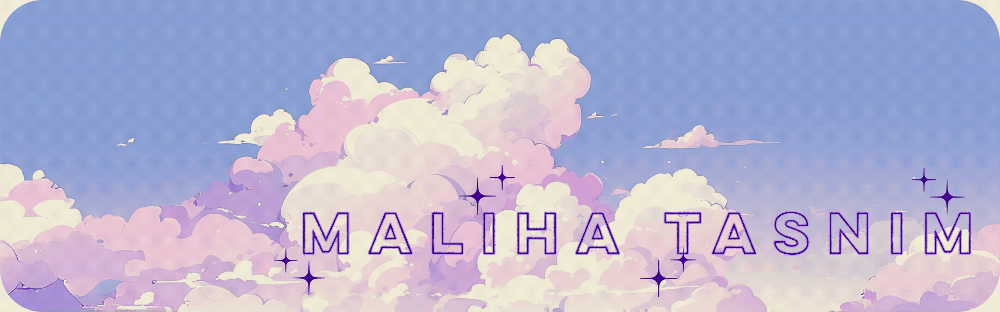

<!-- Banner -->

  

---
<h1 align="center">✦ about me ✦ </h1>

🎓  CS + Math @ CUNY Hunter  

💻 Aspiring Software Engineer 

🧠 Full-Stack Engineering + Machine Learning

I love creating beautiful things that feel intuitive, expressive, and useful. Over the last few years, I’ve built projects ranging from AI-driven ranking models to OCR pipelines, real-time analytics dashboards, and full-stack tools used in real organizations.

As a **Break Through Tech AI Fellow**, I’ve grown through mentorship, experimentation, and the process of taking initiative on projects that challenge me. I care about continuous learning, thoughtful engineering, and building tech that feels both useful and human.

Right now, I’m building out my **ML foundation**, exploring **deeper AI applications**, and working toward roles where I can contribute, learn, and collaborate with talented engineers.  
If you know of opportunities or projects, **I’d love to hear from you.**

Outside of technical work, I care about wellness, routines, games, art, and my birds. 

Connect with me! 
- **Email:** malihatasnim404@gmail.com  
- **LinkedIn:** https://linkedin.com/in/maliha-tasnim04  
- **Art:** https://www.instagram.com/birb.erry/?hl=en 

---
<!-- Section Header -->

<h1 align="center">✦ what i'm working on ✦ </h1>
### Street Systems 
A gamified civic engagement app: rate and upload pictures of street light bases to help the NYC Department of Transportation better prioritize repairs. Complete with a built in data analytics dashboard. 

  
  
  

🔗 [Check it out here!](https://github.com/MalihaT111/street-light-base)

### **AI-Assisted Recruitment System**

A hybrid AI platform designed to make resume screening more fair, accurate, and efficient.
I built an end-to-end ranking pipeline that combines semantic embeddings, machine-learning models, and feature-based scoring to match candidates to job descriptions with improved relevance.

     

🔗 [Check it out here!](https://github.com/MalihaT111/ai-recruitment)

### **League of LeetCode**  

A structured, gamified way to practice coding: League of LeetCode combines an elegant UI with real-time matchmaking, live ranking updates, and question metadata integration. It makes algorithm practice feel more interactive, more visual, and more rewarding.

  
  
  
  
  

🔗 [Check it out here!](https://github.com/MalihaT111/league-of-leetcode)

### **Crossword Puzzle Solver**

A lightweight cross world puzzle solver that extracts structured information from images and PDFs.
I developed a system that extracts puzzle grids from images, segments individual cells, recognizes letters using OCR, and structures the output into a usable digital format.

    

🔗 [Check it out here!](https://github.com/MalihaT111/crossword-puzzle-solver)

---

<h1 align="center">✦ tools & tech ✦ </h1>

### **Languages**

  
  
  
  
  
  
  
  
  
  
  

### **Frameworks**

  
  
  
  
  
  
  
  <!-- Mantine has no devicon, so omit or add custom graphic -->

### **Libraries**

  
  
  
  
  
  
  
  
  
  

### **Tools & Cloud**

  
  
  
  
  
  
  
  
  
  
  
  
  
  

---
<h1 align="center">✦ stats ✦ </h1>

<table align="center">
  <tr>
    <td>
      
    </td>
    <td>
      
    </td>
  </tr>
</table>

